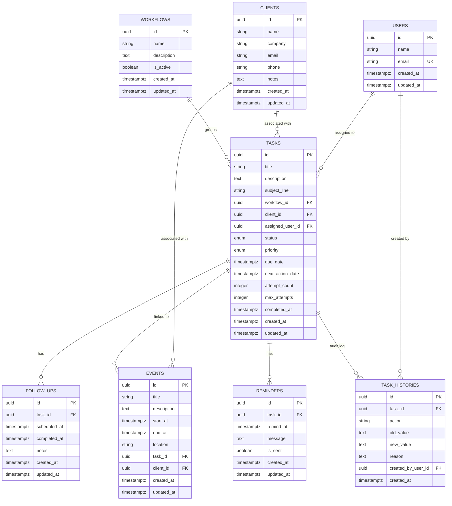

# NextAction Phase 2: Database Domain Model Design

## 1. Executive Summary & Architecture
NextAction is a task and follow-up management system built around **Tasks** as the central domain entity. The database design provides a relational structure in **PostgreSQL 16** using **SQLAlchemy 2.0 ORM** and **Alembic** migrations, optimized for performance, scalability, and historical auditability.

---

## 2. Entity-Relationship (ER) Architecture

---

## 3. Detailed Entity Specifications

### 3.1 Users (`users`)
Represents internal operators and team members assigned to tasks or creating changes.
- `id`: `UUID`, Primary Key, default `uuid.uuid4`
- `name`: `VARCHAR(255)`, NOT NULL
- `email`: `VARCHAR(255)`, UNIQUE, NOT NULL, INDEXED
- `created_at`: `TIMESTAMPTZ`, NOT NULL, default `NOW()`
- `updated_at`: `TIMESTAMPTZ`, NOT NULL, default `NOW()`, on update `NOW()`

### 3.2 Clients (`clients`)
Represents external contacts, customers, or client organizations.
- `id`: `UUID`, Primary Key, default `uuid.uuid4`
- `name`: `VARCHAR(255)`, NOT NULL
- `company`: `VARCHAR(255)`, NULLABLE
- `email`: `VARCHAR(255)`, NULLABLE
- `phone`: `VARCHAR(50)`, NULLABLE
- `notes`: `TEXT`, NULLABLE
- `created_at`: `TIMESTAMPTZ`, NOT NULL, default `NOW()`
- `updated_at`: `TIMESTAMPTZ`, NOT NULL, default `NOW()`, on update `NOW()`

### 3.3 Workflows (`workflows`)
Represents reusable operational processes and grouping for tasks.
- `id`: `UUID`, Primary Key, default `uuid.uuid4`
- `name`: `VARCHAR(255)`, NOT NULL
- `description`: `TEXT`, NULLABLE
- `is_active`: `BOOLEAN`, NOT NULL, default `TRUE`
- `created_at`: `TIMESTAMPTZ`, NOT NULL, default `NOW()`
- `updated_at`: `TIMESTAMPTZ`, NOT NULL, default `NOW()`, on update `NOW()`

### 3.4 Tasks (`tasks`)
The central entity for managing work, follow-up queues, and attempt tracking.
- `id`: `UUID`, Primary Key, default `uuid.uuid4`
- `title`: `VARCHAR(255)`, NOT NULL
- `description`: `TEXT`, NULLABLE
- `subject_line`: `VARCHAR(500)`, NULLABLE
- `workflow_id`: `UUID`, FK `workflows(id)`, NULLABLE, `ON DELETE SET NULL`, INDEXED
- `client_id`: `UUID`, FK `clients(id)`, NULLABLE, `ON DELETE SET NULL`, INDEXED
- `assigned_user_id`: `UUID`, FK `users(id)`, NULLABLE, `ON DELETE SET NULL`, INDEXED
- `status`: `ENUM ('pending', 'in_progress', 'completed', 'cancelled')`, NOT NULL, default `'pending'`, INDEXED
- `priority`: `ENUM ('low', 'medium', 'high', 'urgent')`, NOT NULL, default `'medium'`
- `due_date`: `TIMESTAMPTZ`, NULLABLE, INDEXED
- `next_action_date`: `TIMESTAMPTZ`, NULLABLE, INDEXED
- `attempt_count`: `INTEGER`, NOT NULL, default `0`
- `max_attempts`: `INTEGER`, NOT NULL, default `2`
- `completed_at`: `TIMESTAMPTZ`, NULLABLE
- `created_at`: `TIMESTAMPTZ`, NOT NULL, default `NOW()`
- `updated_at`: `TIMESTAMPTZ`, NOT NULL, default `NOW()`, on update `NOW()`

### 3.5 Follow-ups (`follow_ups`)
Represents planned or executed follow-up interactions associated with a specific task.
- `id`: `UUID`, Primary Key, default `uuid.uuid4`
- `task_id`: `UUID`, FK `tasks(id)`, NOT NULL, `ON DELETE CASCADE`, INDEXED
- `scheduled_at`: `TIMESTAMPTZ`, NOT NULL, INDEXED
- `completed_at`: `TIMESTAMPTZ`, NULLABLE
- `notes`: `TEXT`, NULLABLE
- `created_at`: `TIMESTAMPTZ`, NOT NULL, default `NOW()`
- `updated_at`: `TIMESTAMPTZ`, NOT NULL, default `NOW()`, on update `NOW()`

### 3.6 Reminders (`reminders`)
Represents alert notifications. Reminders are notification triggers and do **NOT** count as task attempts.
- `id`: `UUID`, Primary Key, default `uuid.uuid4`
- `task_id`: `UUID`, FK `tasks(id)`, NOT NULL, `ON DELETE CASCADE`, INDEXED
- `remind_at`: `TIMESTAMPTZ`, NOT NULL, INDEXED
- `message`: `TEXT`, NOT NULL
- `is_sent`: `BOOLEAN`, NOT NULL, default `FALSE`, INDEXED
- `created_at`: `TIMESTAMPTZ`, NOT NULL, default `NOW()`
- `updated_at`: `TIMESTAMPTZ`, NOT NULL, default `NOW()`, on update `NOW()`

### 3.7 Events (`events`)
Represents calendar activities or meetings linked optionally to tasks and/or clients.
- `id`: `UUID`, Primary Key, default `uuid.uuid4`
- `title`: `VARCHAR(255)`, NOT NULL
- `description`: `TEXT`, NULLABLE
- `start_at`: `TIMESTAMPTZ`, NOT NULL, INDEXED
- `end_at`: `TIMESTAMPTZ`, NULLABLE
- `location`: `VARCHAR(255)`, NULLABLE
- `task_id`: `UUID`, FK `tasks(id)`, NULLABLE, `ON DELETE SET NULL`, INDEXED
- `client_id`: `UUID`, FK `clients(id)`, NULLABLE, `ON DELETE SET NULL`, INDEXED
- `created_at`: `TIMESTAMPTZ`, NOT NULL, default `NOW()`
- `updated_at`: `TIMESTAMPTZ`, NOT NULL, default `NOW()`, on update `NOW()`

### 3.8 Task History (`task_histories`)
Immutable chronological audit log capturing lifecycle transitions, attempts, and attribute changes.
- `id`: `UUID`, Primary Key, default `uuid.uuid4`
- `task_id`: `UUID`, FK `tasks(id)`, NULLABLE, `ON DELETE SET NULL`, INDEXED
- `action`: `VARCHAR(100)`, NOT NULL (e.g. `created`, `attempt`, `postponed`, `completed`, `status_changed`, `priority_changed`, `reassigned`)
- `old_value`: `TEXT`, NULLABLE
- `new_value`: `TEXT`, NULLABLE
- `reason`: `TEXT`, NULLABLE
- `created_by_user_id`: `UUID`, FK `users(id)`, NULLABLE, `ON DELETE SET NULL`, INDEXED
- `created_at`: `TIMESTAMPTZ`, NOT NULL, default `NOW()`

---

## 4. Constraint and Indexing Strategy

1. **Foreign Key Deletion Rules**:
   - Deleting a `Task` cascades and cleans up operational child records: `FollowUps` and `Reminders`.
   - Deleting a `Task` sets `task_histories.task_id` to `NULL` (`ON DELETE SET NULL`), ensuring historical audit logs are **preserved independently** and never deleted automatically.
   - Deleting a `Client`, `Workflow`, or `User` sets the foreign key on `Tasks`, `Events`, and `TaskHistories` to `NULL` (`ON DELETE SET NULL`), preserving historical integrity.
2. **Indexing Summary**:
   - `users.email` (UNIQUE Index)
   - `tasks.status`, `tasks.due_date`, `tasks.next_action_date` (Queue scheduling and filtering)
   - `tasks.client_id`, `tasks.workflow_id`, `tasks.assigned_user_id` (Relationship lookups)
   - `follow_ups.task_id`, `follow_ups.scheduled_at` (Timeline queries)
   - `reminders.task_id`, `reminders.remind_at`, `reminders.is_sent` (Background poller index)
   - `events.start_at`, `events.task_id`, `events.client_id` (Calendar queries)
   - `task_histories.task_id`, `task_histories.created_by_user_id` (Audit lookups)
3. **Timestamp Strategy**:
   - All timestamps use timezone-aware `TIMESTAMPTZ` (`DateTime(timezone=True)`) in UTC.

---

## 5. Migration and Verification Results

### 5.1 Alembic Migrations
- **Initial Migration**: `2261f48e1766` (`backend/alembic/versions/2261f48e1766_create_initial_phase_2_schema.py`) - Created foundational Phase 2 tables and enums.
- **Audit Correction Migration**: `74b3a4c2d28a` (`backend/alembic/versions/74b3a4c2d28a_preserve_task_history_on_task_delete.py`) - Altered `task_histories.task_id` to nullable and updated foreign key constraint to `ON DELETE SET NULL`.
- **Applied Status**: Both migrations applied cleanly to live PostgreSQL 16 container (`head: 74b3a4c2d28a`).

### 5.2 Live PostgreSQL Inspection
- **Tables Verified (9)**: `alembic_version`, `clients`, `events`, `follow_ups`, `reminders`, `task_histories`, `tasks`, `users`, `workflows`.
- **Enums Verified (2)**: `task_status` (`PENDING`, `IN_PROGRESS`, `COMPLETED`, `CANCELLED`), `task_priority` (`LOW`, `MEDIUM`, `HIGH`, `URGENT`).
- **Foreign Keys Verified (9)**:
  - `tasks.assigned_user_id` -> `users.id` (ON DELETE SET NULL)
  - `tasks.client_id` -> `clients.id` (ON DELETE SET NULL)
  - `tasks.workflow_id` -> `workflows.id` (ON DELETE SET NULL)
  - `events.client_id` -> `clients.id` (ON DELETE SET NULL)
  - `events.task_id` -> `tasks.id` (ON DELETE SET NULL)
  - `follow_ups.task_id` -> `tasks.id` (ON DELETE CASCADE)
  - `reminders.task_id` -> `tasks.id` (ON DELETE CASCADE)
  - `task_histories.created_by_user_id` -> `users.id` (ON DELETE SET NULL)
  - `task_histories.task_id` -> `tasks.id` (ON DELETE SET NULL)
- **Indexes Verified (26)**: All primary keys, foreign keys, unique constraint on user email, and filter indices.

