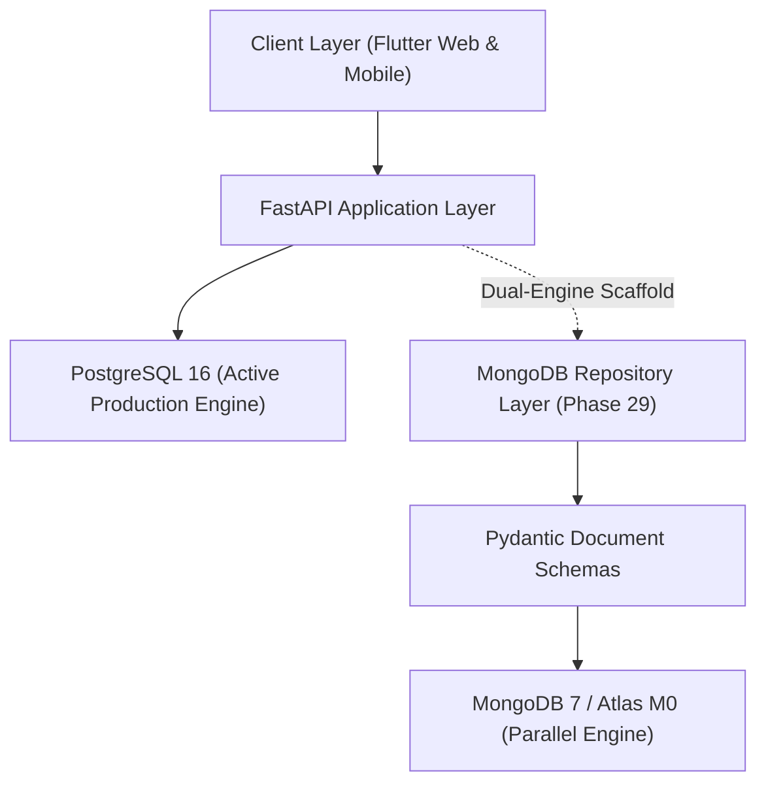

# Phase 29 — MongoDB Document Schemas & Repository Layer Report

## 1. Architectural Status & Dual-Engine Context

> [!IMPORTANT]
> **PostgreSQL remains the sole active primary database for the NextAction application.**
> MongoDB is implemented as a parallel, isolated persistence layer. No application services, API routers, or Flutter client code have been switched to MongoDB in Phase 29.

Phase 29 establishes the strongly typed document schemas, repository abstractions, idempotent index definitions, and test verification suite for MongoDB. This forms the foundation for the upcoming Phase 30 (Service Layer & Dual-Engine Integration) and Phase 31 (Zero-Downtime Data Migration).



---

## 2. MongoDB Collection Design

All application entities have corresponding MongoDB collections designed for schema consistency and high performance.

| Collection Name | Entity Type | Persistence Strategy | Primary Identifier |
| :--- | :--- | :--- | :--- |
| `users` | User accounts | Top-level collection | String UUID (`_id`) |
| `user_settings` | User preferences | Top-level collection | String UUID (`_id`), indexed `user_id` |
| `clients` | Client directory | Top-level collection | String UUID (`_id`) |
| `workflows` | Workflows & stages | Top-level collection | String UUID (`_id`) |
| `tasks` | Core tasks | Top-level collection with embedded subdocs | String UUID (`_id`) |
| `task_history` | Audit trail | Top-level collection | String UUID (`_id`), indexed `task_id` |
| `notifications` | In-app alerts | Top-level collection | String UUID (`_id`), indexed `user_id` |
| `events` | Calendar appointments | Top-level collection | String UUID (`_id`) |
| `refresh_tokens` | Revocable auth tokens | Top-level collection | String UUID (`_id`), indexed `token_hash` |
| `task_templates` | Blueprint definitions | Top-level collection | String UUID (`_id`) |
| `recurring_tasks` | Recurring schedules | Top-level collection | String UUID (`_id`) |
| `recurring_task_executions` | Recurrence idempotency | Top-level collection | String UUID (`_id`), compound `(task_id, slot)` |
| `_infra_health` | Readiness probes | Top-level collection | String UUID (`_id`) |

---

## 3. Embedded vs. Top-Level Modeling Decisions

MongoDB's document model allows choosing between embedded subdocuments and referenced top-level collections. The decisions for NextAction are grounded in operational access patterns, document size boundaries, and data lifecycles:

### A. Embedded: Reminders and FollowUps inside `tasks`
- **Rationale**: A reminder or follow-up item has no business meaning outside the context of its parent task. They are created, inspected, completed, and deleted in strict lockstep with the task.
- **Benefits**:
  - Eliminates relational `JOIN` operations when rendering the 10-section Task Detail screen.
  - Guarantees atomic subdocument updates (pushing reminders, completing follow-ups) in a single document operation without distributed transaction overhead.
  - Tasks typically have 1–5 reminders and 1–3 follow-ups, presenting zero risk of approaching MongoDB's 16MB document limit.

### B. Denormalized Metadata Snapshots inside `tasks`
- **Fields**: `client_name`, `workflow_name`, `assigned_user_name`, `assigned_user_email`.
- **Rationale**: Dashboard KPIs, Kanban boards, and task lists require showing assignee and client names alongside tasks. In a relational database, this requires 3 `LEFT OUTER JOIN`s per query. In MongoDB, denormalizing these display names at write time enables single-collection scans with index support.

### C. Top-Level: `task_history` (Audit Log)
- **Rationale**: Long-lived tasks can accumulate dozens or hundreds of state changes, attempts, reassignment events, and edit logs. Embedding audit logs would lead to unbounded document growth and document re-allocation on disk.
- **Architecture**: Stored in a dedicated `task_history` collection indexed by `("task_id", 1), ("created_at", -1)`.

### D. Top-Level: `notifications` & `refresh_tokens`
- **Rationale**: Both collections require lifecycle management, high-volume insertions, independent pagination, and potential TTL purging. Refresh tokens require rapid single-key hash lookups on every token refresh request.

### E. Top-Level: `recurring_task_executions`
- **Rationale**: Serves as the idempotency ledger for recurring task runs. Must enforce strict uniqueness on `(recurring_task_id, scheduled_for)` across workers to guarantee zero duplicate task generation.

---

## 4. Pydantic Document Schema Design

The document schemas reside in `backend/app/documents/`:

### Primary Design Patterns:
1. **String UUID Primary Keys**: Every document schema inherits from `BaseDocument`, using a 36-character string UUID as `id` with alias `_id`. This maintains exact operational parity with PostgreSQL's `UUID(as_uuid=True)` columns.
2. **Timezone-Aware UTC Datetimes**: All timestamp fields (`created_at`, `updated_at`, `due_date`, etc.) enforce timezone awareness using the `utcnow()` helper.
3. **Pydantic v2 Alias Handling**:
   - `to_mongo()`: Serializes `id` to `_id` for direct PyMongo insertion.
   - `model_validate(mongo_dict)`: Deserializes `_id` back to `doc.id`.
   - `to_domain()`: Serializes `id` without `_id` for consumption by domain models and API contracts.
4. **Email Normalization**: `UserDocument` enforces automatic stripping and lowercase normalization.
5. **Enum Parity**: Uses existing domain enums (`TaskStatus`, `TaskPriority`, `RecurrenceType`) directly from `app.models.enums`.

```python
# Document Hierarchy
BaseModel
  ├── BaseSubDocument
  │     ├── ReminderSubDocument
  │     └── FollowUpSubDocument
  ├── BaseDocument (alias _id <-> id, to_mongo(), to_domain())
  │     ├── UserDocument
  │     ├── UserSettingsDocument
  │     ├── ClientDocument
  │     ├── WorkflowDocument
  │     ├── TaskDocument (with List[ReminderSubDocument], List[FollowUpSubDocument])
  │     ├── NotificationDocument
  │     ├── RefreshTokenDocument
  │     ├── TaskTemplateDocument
  │     ├── RecurringTaskDocument
  │     └── EventDocument
  ├── TaskHistoryDocument
  └── RecurringTaskExecutionDocument
```

---

## 5. MongoDB Repository Layer

The repository layer is built on `BaseMongoRepository` in `backend/app/repositories/`:

### Base Capabilities (`BaseMongoRepository`):
- `find_by_id(id_val)`: Safe lookup by UUID string or `uuid.UUID` instance.
- `find_one(filter_query)`: Single document matching.
- `find_many(filter_query, sort_by, sort_order, limit, skip)`: Paginated, sorted query cursor formatting.
- `insert_doc(payload)`: Injects default string UUID and UTC timestamps, normalizes `_id`.
- `update_by_id(id_val, update_fields)`: Atomic `$set` update with automatic `updated_at` refresh.
- `delete_by_id(id_val)`: Boolean deletion confirmation.
- `delete_many(filter_query)`: Bulk purge returning deleted count.
- `exists(filter_query)`: O(1) projection query using `limit(1)`.
- `count(filter_query)`: Fast count estimation/query.
- `paginate_find(filter_query, sort_by, sort_order, page, page_size)`: Standardized pagination returning `(items, total_count)`.

### Concrete Repositories:
1. [UserRepository](file:///c:/bhanu/NEXT%20ACTION/backend/app/repositories/user_repository.py): Case-insensitive email lookups, `email_exists`, user listing with active filters.
2. [UserSettingsRepository](file:///c:/bhanu/NEXT%20ACTION/backend/app/repositories/user_settings_repository.py): Atomic `upsert_for_user`, single-document preference guarantee.
3. [ClientRepository](file:///c:/bhanu/NEXT%20ACTION/backend/app/repositories/client_repository.py): Multi-field regex search across name, company, email.
4. [WorkflowRepository](file:///c:/bhanu/NEXT%20ACTION/backend/app/repositories/workflow_repository.py): Active stage listing and name search.
5. [TaskRepository](file:///c:/bhanu/NEXT%20ACTION/backend/app/repositories/task_repository.py): Multi-criteria querying (status, priority, assigned user, dates, text search), atomic `increment_attempt` with max attempts ceiling, embedded reminder/follow-up management.
6. [TaskHistoryRepository](file:///c:/bhanu/NEXT%20ACTION/backend/app/repositories/task_history_repository.py): Immutable audit log recording, descending temporal ordering.
7. [NotificationRepository](file:///c:/bhanu/NEXT%20ACTION/backend/app/repositories/notification_repository.py): Read/unread lifecycle, batch mark-all-read, deduplicated creation helper.
8. [RefreshTokenRepository](file:///c:/bhanu/NEXT%20ACTION/backend/app/repositories/refresh_token_repository.py): SHA-256 hash lookup, single revocation with replacement tracking, user-wide session invalidation, expired token purging.
9. [TaskTemplateRepository](file:///c:/bhanu/NEXT%20ACTION/backend/app/repositories/task_template_repository.py): Blueprint CRUD and active listing.
10. [RecurringTaskRepository](file:///c:/bhanu/NEXT%20ACTION/backend/app/repositories/recurring_task_repository.py): Due schedule evaluation, atomic `update_next_run`.
11. [RecurringTaskExecutionRepository](file:///c:/bhanu/NEXT%20ACTION/backend/app/repositories/recurring_task_execution_repository.py): Idempotency verification and slot execution records.
12. [EventRepository](file:///c:/bhanu/NEXT%20ACTION/backend/app/repositories/event_repository.py): Date window range queries, task/client associations.

---

## 6. Index Design & Idempotent Initialization

All indexes are created idempotently via `init_mongo_indexes()` in `backend/app/db/mongodb.py`:

```python
# Idempotent Index Matrix
USERS:
  - {"email": 1} [UNIQUE] -> idx_users_email_unique
  - {"is_active": 1} -> idx_users_is_active
  - {"created_at": -1} -> idx_users_created_at

USER_SETTINGS:
  - {"user_id": 1} [UNIQUE] -> idx_user_settings_user_id_unique

NOTIFICATIONS:
  - {"user_id": 1, "created_at": -1} -> idx_notifications_user_created
  - {"user_id": 1, "is_read": 1, "created_at": -1} -> idx_notifications_user_read_created
  - {"user_id": 1, "dedup_key": 1} [UNIQUE, PARTIAL: dedup_key string] -> idx_notifications_user_dedup_unique

REFRESH_TOKENS:
  - {"token_hash": 1} [UNIQUE] -> idx_refresh_tokens_hash_unique
  - {"user_id": 1, "is_revoked": 1} -> idx_refresh_tokens_user_revoked
  - {"expires_at": 1} -> idx_refresh_tokens_expires_at

RECURRING_TASK_EXECUTIONS:
  - {"recurring_task_id": 1, "scheduled_for": 1} [UNIQUE] -> idx_recurring_exec_task_sched_unique
  - {"recurring_task_id": 1, "executed_at": -1} -> idx_recurring_exec_task_executed

TASKS:
  - {"status": 1} -> idx_tasks_status
  - {"priority": 1} -> idx_tasks_priority
  - {"assigned_user_id": 1} -> idx_tasks_assigned_user_id
  - {"client_id": 1} -> idx_tasks_client_id
  - {"workflow_id": 1} -> idx_tasks_workflow_id
  - {"due_date": 1} -> idx_tasks_due_date
  - {"next_action_date": 1} -> idx_tasks_next_action_date
  - {"created_at": -1} -> idx_tasks_created_at
  - {"updated_at": -1} -> idx_tasks_updated_at
  - Compound: {"assigned_user_id": 1, "status": 1} -> idx_tasks_user_status
  - Compound: {"client_id": 1, "status": 1} -> idx_tasks_client_status
  - Compound: {"workflow_id": 1, "status": 1} -> idx_tasks_workflow_status
  - Compound: {"status": 1, "next_action_date": 1} -> idx_tasks_status_next_action

TASK_HISTORY:
  - {"task_id": 1, "created_at": -1} -> idx_task_history_task_created
  - {"created_at": -1} -> idx_task_history_created_at

RECURRING_TASKS:
  - {"is_active": 1, "next_run_at": 1} -> idx_recurring_tasks_active_next_run
  - {"created_at": -1} -> idx_recurring_tasks_created_at

EVENTS:
  - {"start_at": 1} -> idx_events_start_at
  - {"task_id": 1} -> idx_events_task_id
  - {"client_id": 1} -> idx_events_client_id
```

---

## 7. Consistency & Relational Parity Strategy

Without relational foreign key constraints enforced by the database engine, the MongoDB persistence architecture preserves domain integrity through three mechanisms:

1. **Database-Level Unique Constraints**:
   - Unique email addresses prevented at driver level via `idx_users_email_unique`.
   - Single user setting record guaranteed via `idx_user_settings_user_id_unique`.
   - Notification flood prevention guaranteed via partial unique index `idx_notifications_user_dedup_unique`.
   - Double execution of recurrence slots prevented via `idx_recurring_exec_task_sched_unique`.
   - Token hijacking replay prevented via `idx_refresh_tokens_hash_unique`.

2. **Atomic In-Document Updates**:
   - Attempt ceiling checking uses atomic MongoDB `$expr`:
     `{"_id": tid, "$expr": {"$lt": ["$attempt_count", "$max_attempts"]}}`
     combined with `{"$inc": {"attempt_count": 1}}`. This guarantees zero race conditions without multi-document distributed locks.

3. **Application-Enforced Referential Integrity**:
   - Where cascade deletion or ownership boundaries apply (e.g., deleting a user or task), the repository provides targeted methods (`delete_all_for_user`, `delete_for_task`) designed to be coordinated within service-layer transactions in Phase 30.

---

## 8. Verification Results

### A. Dedicated Phase 29 MongoDB Test Suite
- **Test File**: `backend/tests/test_mongodb_repositories.py`
- **Total Tests**: 16
- **Result**: 16 Passed, 0 Failed, 0 Skipped (1.21s)
- **Coverage**: Document validation, UUID serialization, UTC timezone consistency, CRUD across all 12 repositories, pagination, sorting, search regex, unique index violations, notification deduplication, refresh token rotation, recurrence idempotency, and embedded reminder/follow-up operations.

### B. Full Backend Pytest Suite
- **Total Tests**: 228 (212 existing + 16 Phase 29)
- **Result**: 228 Passed, 0 Failed (100% Green)
- **Runtime**: 107.45s

### C. Flutter Quality Gates
- **`flutter analyze`**: 0 issues found (ran in 84.1s)
- **`flutter test`**: 500 / 500 tests passed (ran in 29s)

### D. Production Stack & Health Status
- **PostgreSQL 16**: Connected and healthy
- **FastAPI `/health`**: `{"status": "healthy", "database": "connected"}`
- **FastAPI `/ready`**: `{"status": "ready", "database": "connected"}`
- **PostgreSQL Models & Migrations**: 100% intact, zero regressions

---

## 9. Next Steps (Phase 30 Preview)

With document schemas and the repository layer fully verified, Phase 30 will introduce:
1. Dual-Engine Service Interface abstraction (switching mechanism between SQLAlchemy and MongoDB).
2. Service-layer business transaction wrappers using `get_mongo_session()`.
3. Read/Write dual-run validation hooks for data consistency checking.
